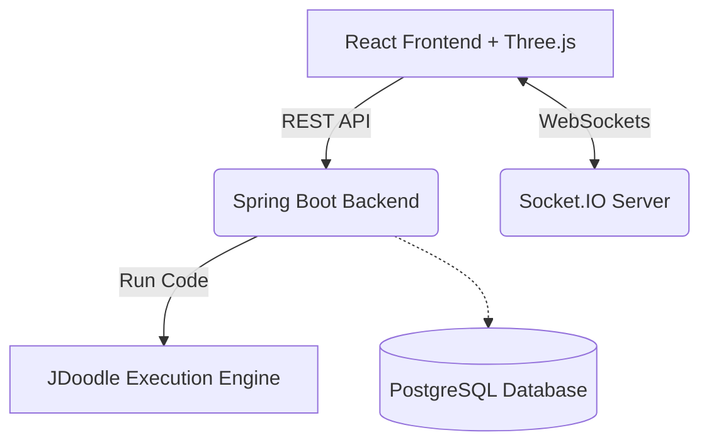

# 🚀 TrickCode

**The all-in-one platform to master algorithms, ace technical interviews, and build the future with a community of elite developers.**

## 📋 Overview
💡 Why "TrickCode"? It's not just another coding platform. TrickCode combines the rigor of technical interviews with a premium, engaging user experience. 
This platform provides an interactive environment where users can practice algorithms, compete in weekly contests, and experience mock interviews powered by AI and real-time collaboration. 
Instead of a simple code editor, TrickCode immerses you in a "frontier" aesthetic featuring 3D graphics, real-time leaderboards, and a supportive community of thousands of developers.

## 🌟 Core Features
- 🤖 **Interactive AI Assistant**: AI-powered features for generating code challenges, explaining test failures, and guiding users through mock interviews.
- ⚡ **JDoodle Code Execution**: Robust algorithm testing environment supporting automated test cases and real-time execution feedback.
- 👥 **Real-time Collaboration**: Multi-user cursor synchronization (Socket.IO) allowing developers to pair-program and debug together seamlessly.
- 🏆 **Competitive Contests**: Live programming competitions with real-time scoring and global leaderboards.
- 🎨 **Premium 3D Aesthetics**: Futuristic, terminal-inspired interface built with Three.js WebGL and scroll-reveal animations.

## 🚀 Tech Stack

### 🎨 Frontend (fe)
- **Core**: React 18, Vite 6
- **UI & Animation**: Tailwind CSS, Three.js (`@react-three/fiber`), Framer Motion
- **Routing & Fetching**: React Router, Axios

### ⚙️ Backend Services (be)
- **Core**: Spring Boot (Java Mono-repo)
- **Storage**: PostgreSQL database
- **Integrations**: JDoodle API (Code Execution), Next-Auth (Security), Socket.IO (Real-time)

## 🏗️ Architecture Design

TrickCode follows a robust client-server architecture with real-time capabilities.



## 📁 Project Structure

```text
trickcode/
├── docker-compose.yml       # Docker deployment configs
├── fe/                      # Frontend Application (React/Vite)
│   ├── src/components/      # UI Components & 3D Beams
│   └── src/pages/           # Main Views (Learn, Contests, Profile)
└── be/
    └── backend-mono/        # Core Spring Boot Application
        ├── src/main/java/   # Business Logic & Controllers
        └── src/main/resources/ # Configurations
```

## 🛠️ Quick Start (Local)

### Prerequisites
- Node.js (v18+)
- Java 17+
- JDoodle API Credentials

### 1. Environment Setup

**Backend (`be/backend-mono/src/main/resources/config/application.yml`):**
Ensure your application properties have the correct database connections and inject your JDoodle keys into your environment.
```bash
export JDOODLE_CLIENT_ID="your_client_id"
export JDOODLE_CLIENT_SECRET="your_client_secret"
```

**Frontend (`fe/.env`):**
```env
VITE_API_URL=http://localhost:8080
```

### 2. Launch Backend
Navigate to the backend directory and start the Spring Boot application:
```bash
cd be/backend-mono
./mvnw spring-boot:run
```

### 3. Launch Frontend
In a new terminal, start the Vite development server:
```bash
cd fe
npm install
npm run dev
```

### 4. Access the Application
Once both servers are running:
- **Frontend App**: http://localhost:5173
- **Backend API**: http://localhost:8080

## 🤝 Contributing
Contributions are welcome! Please feel free to submit a Pull Request.
1. Fork the Project
2. Create your Feature Branch (`git checkout -b feature/AmazingFeature`)
3. Commit your Changes (`git commit -m 'Add some AmazingFeature'`)
4. Push to the Branch (`git push origin feature/AmazingFeature`)
5. Open a Pull Request

## 📝 License
This project is licensed under the MIT License - see the LICENSE file for details.
